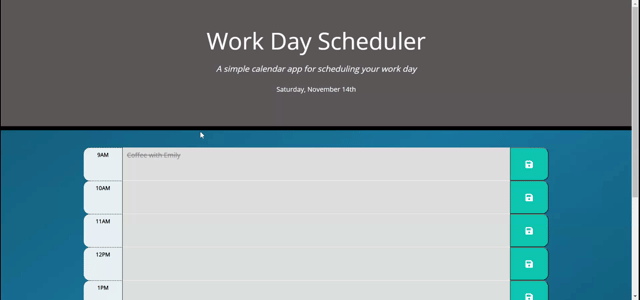

<h1 style="text-align:center">Daily Planner</h1>

<h4><b>A daily calendar app for effective scheduling and time management.</b></h4>
 

Currently deployed at [<!--GitHub Pages-->](https://joeldore.github.io/Daily-Planner/)

---
## Features

- Color-coded time blocks distinguish past, in-progress, and upcoming events

- App automatically updates to current date using [Moment.js](https://momentjs.com/)

- Easily save events to local storage for future access

---

## Results
- 
- 

---
## Future scope

- <!-- Add features... -->
- <!-- Add features... -->

---
##  License
This project is [MIT](https://github.com/JoelDore/Daily-Planner/blob/main/LICENSE) licensed.  
© 2020 [Joel Dore](https://github.com/JoelDore)  

---
 

 
 

